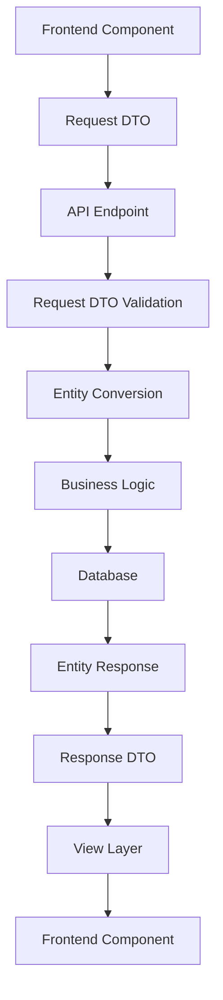
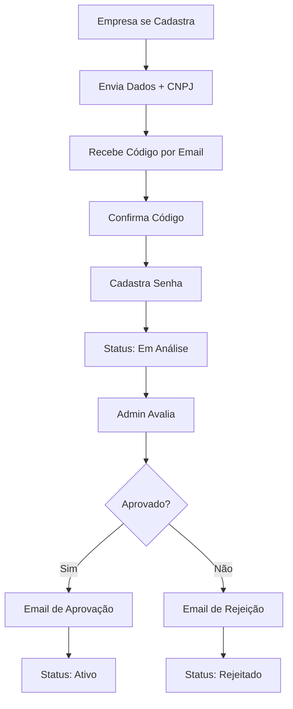
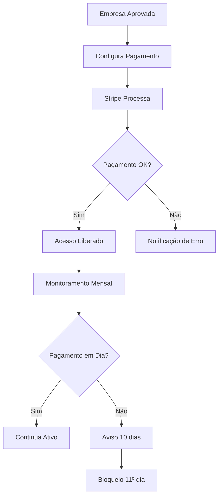

# Estoque Mestre - Sistema de Gerenciamento de Estoque

## 📋 Visão Geral

O **Estoque Mestre** é um sistema SaaS de gerenciamento de estoque desenvolvido para atender empresas de diversos segmentos, com foco inicial em motopeças. O sistema oferece funcionalidades completas de CRUD, controle de entrada/saída e geração de relatórios.

## 🏗️ Arquitetura

### Monorepo Structure
```
estoque_mestre/
├── apps/
│   ├── api/          # Backend NestJS
│   └── front/        # Frontend Angular
├── packages/
│   ├── models/       # Entidades, DTOs e Interfaces compartilhadas
│   ├── ui/           # Componentes UI reutilizáveis
│   └── eslint-config/ # Configurações ESLint
└── docs/             # Documentação do sistema
```

### Camadas do Sistema

#### 1. **Entity Layer** (Core)
- **Localização**: `packages/models/src/entity/`
- **Responsabilidade**: Camada central do sistema
- **Função**: Define as estruturas de dados que transitam entre frontend e backend
- **Exemplo**: `Product`, `Company`, `User`, `Transaction`

#### 2. **DTO Layer** (Data Transfer Objects)
- **Localização**: `packages/models/src/dto/`
- **Request DTOs**: `packages/models/src/dto/request/`
- **Response DTOs**: `packages/models/src/dto/response/`
- **Responsabilidade**: Contratos de comunicação entre frontend e backend

#### 3. **View Layer** (Presentation)
- **Localização**: `packages/models/src/view/`
- **Responsabilidade**: Camada de visualização para componentes aninhados
- **Função**: Transforma entidades em estruturas otimizadas para apresentação

#### 4. **Interface Layer** (Contracts)
- **Localização**: `packages/models/src/interfaces/`
- **Responsabilidade**: Define contratos e interfaces do sistema

## 🔄 Fluxo de Dados

### Fluxo Padrão de Operação



### Exemplo Prático: Criação de Produto

1. **Frontend**: Usuário preenche formulário
2. **Request DTO**: `CreateProductRequestDto` é enviado
3. **API**: Recebe e valida o DTO
4. **Entity**: Converte para `Product` entity
5. **Database**: Persiste no banco
6. **Response DTO**: Retorna `ProductResponseDto`
7. **View**: Se necessário, cria `ProductView` para apresentação
8. **Frontend**: Exibe o produto criado

## 🏢 Modelo de Negócio

### Tipos de Usuário

#### 1. **Admin** (Sistema)
- **Responsabilidades**:
  - Aprovar/rejeitar cadastros de empresas
  - Gerenciar todas as empresas cadastradas
  - Revogar acessos
  - Monitorar pagamentos
- **Acesso**: Total ao sistema

#### 2. **Business** (Empresa)
- **Responsabilidades**:
  - Gerenciar estoque da empresa
  - Cadastrar produtos, fornecedores, clientes
  - Realizar transações
  - Gerar relatórios
- **Acesso**: Limitado à própria empresa

### Fluxo de Cadastro e Aprovação



## 💳 Sistema de Pagamentos

### Plano Atual
- **Valor**: R$ 150,00/mês
- **Método**: Stripe (Cartão)
- **Recorrência**: Mensal
- **Expansibilidade**: Preparado para múltiplos planos

### Funcionalidades de Pagamento
- ✅ Pagamento recorrente
- ✅ Descontos sazonais (ex: Natal)
- ✅ Desconto por indicação
- ✅ Controle de inadimplência
- ✅ Bloqueio automático

### Fluxo de Pagamento



## 📊 Funcionalidades do Sistema

### Gestão de Estoque
- ✅ CRUD de produtos
- ✅ Controle de entrada/saída
- ✅ Rastreamento de movimentações
- ✅ Alertas de estoque baixo
- ✅ Códigos de barras/QR

### Gestão de Relacionamentos
- ✅ Fornecedores
- ✅ Clientes
- ✅ Categorias
- ✅ Marcas

### Relatórios e Analytics
- ✅ Relatórios de movimentação
- ✅ Análise de vendas
- ✅ Controle de custos
- ✅ Dashboard executivo

### Sistema de Logs de Erro
- ✅ Captura automática de erros do frontend
- ✅ Logs estruturados do backend
- ✅ Banco de dados separado para logs
- ✅ Dashboard de monitoramento
- ✅ Alertas automáticos por severidade
- ✅ Analytics de erros e tendências

## 🚀 Tecnologias

### Backend
- **Framework**: NestJS
- **Database**: PostgreSQL + Prisma
- **Autenticação**: JWT + Passport
- **Pagamentos**: Stripe
- **Validação**: Class Validator

### Frontend
- **Framework**: Angular 20
- **UI**: Angular Material
- **Estado**: RxJS
- **Validação**: Reactive Forms

### DevOps
- **Deploy**: Vercel (Frontend) + Railway/Heroku (Backend)
- **CI/CD**: GitHub Actions
- **Cache**: Turbo + pnpm
- **Monitoramento**: Vercel Analytics
- **Logs de Erro**: Sistema independente com banco separado

## 📁 Estrutura de Documentação

- [`architecture/`](./architecture/) - Arquitetura detalhada
- [`entities/`](./entities/) - Documentação das entidades
- [`flows/`](./flows/) - Fluxos de negócio
- [`modules/`](./modules/) - Módulos específicos
- [`api/`](./api/) - Documentação da API
- [`deployment/`](./deployment/) - Guias de deploy

## 🎯 Próximos Passos

1. ✅ Documentação da arquitetura
2. ✅ Implementação do módulo de pagamentos
3. ✅ Documentação das entidades existentes
4. ✅ Fluxos de negócio detalhados
5. ✅ Sistema de logs de erro
6. ✅ Guias de desenvolvimento

---

**Desenvolvido com ❤️ para otimizar a gestão de estoque das empresas brasileiras.**
