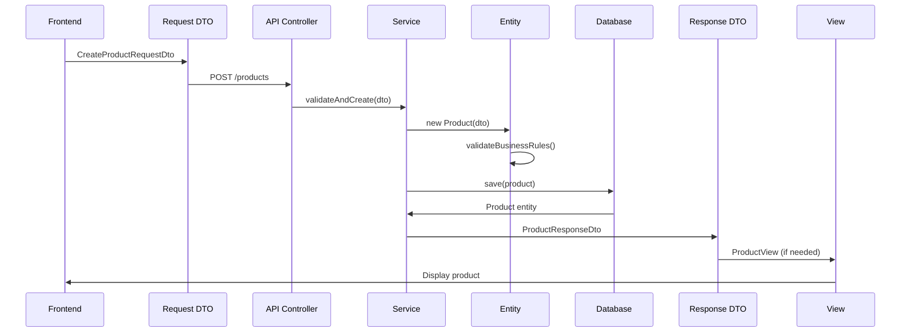
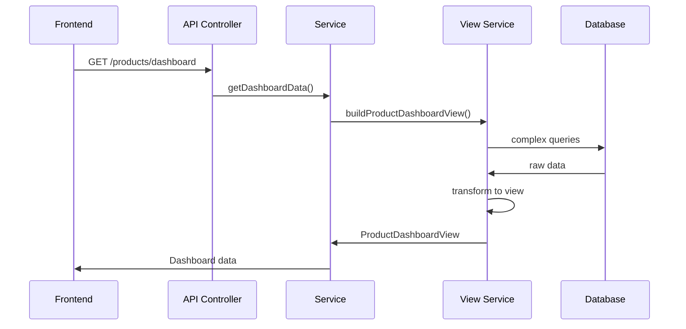
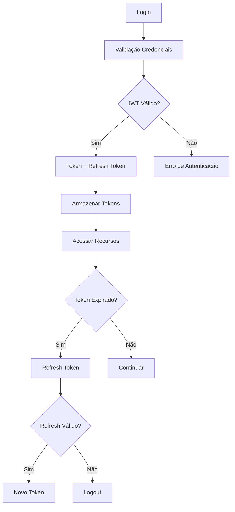

# Arquitetura do Sistema Estoque Mestre

## 🏗️ Visão Geral da Arquitetura

O Estoque Mestre segue uma arquitetura de **monorepo** com separação clara de responsabilidades, utilizando **Domain-Driven Design (DDD)** e **Clean Architecture** como base conceitual.

## 📦 Estrutura do Monorepo

```
estoque_mestre/
├── apps/
│   ├── api/                    # Backend NestJS
│   │   ├── src/
│   │   │   ├── modules/        # Módulos de negócio
│   │   │   ├── shared/         # Código compartilhado
│   │   │   ├── config/         # Configurações
│   │   │   └── main.ts
│   │   ├── prisma/             # Schema do banco
│   │   └── package.json
│   └── front/                  # Frontend Angular
│       ├── src/
│       │   ├── app/
│       │   │   ├── modules/    # Módulos Angular
│       │   │   ├── shared/     # Componentes compartilhados
│       │   │   └── core/       # Serviços core
│       │   └── assets/
│       └── package.json
├── packages/
│   ├── models/                 # 🎯 CAMADA CORE
│   │   ├── src/
│   │   │   ├── entity/         # Entidades de domínio
│   │   │   ├── dto/            # DTOs de comunicação
│   │   │   ├── view/           # Camada de visualização
│   │   │   └── interfaces/     # Contratos
│   │   └── package.json
│   ├── ui/                     # Componentes UI reutilizáveis
│   ├── eslint-config/          # Configurações ESLint
│   └── typescript-config/      # Configurações TypeScript
└── docs/                       # Documentação
```

## 🎯 Camadas da Arquitetura

### 1. **Entity Layer** (Domínio)
**Localização**: `packages/models/src/entity/`

**Responsabilidades**:
- Define as regras de negócio fundamentais
- Representa os conceitos centrais do domínio
- Contém a lógica de validação de domínio
- É independente de frameworks e tecnologias

**Exemplos**:
```typescript
// Product Entity
export class Product {
  id: string;
  name: string;
  sku: string;
  price: number;
  stock: number;
  companyId: string;
  
  // Regras de negócio
  canSell(quantity: number): boolean {
    return this.stock >= quantity;
  }
  
  updateStock(quantity: number, type: 'in' | 'out'): void {
    if (type === 'out' && !this.canSell(quantity)) {
      throw new Error('Estoque insuficiente');
    }
    this.stock += type === 'in' ? quantity : -quantity;
  }
}
```

### 2. **DTO Layer** (Comunicação)
**Localização**: `packages/models/src/dto/`

**Request DTOs** (`request/`):
- Dados enviados do frontend para o backend
- Validação de entrada
- Contratos de API

**Response DTOs** (`response/`):
- Dados retornados do backend para o frontend
- Estrutura padronizada de resposta
- Transformação de entidades para apresentação

**Exemplo**:
```typescript
// Request DTO
export class CreateProductRequestDto {
  @IsString()
  @IsNotEmpty()
  name: string;
  
  @IsString()
  @IsNotEmpty()
  sku: string;
  
  @IsNumber()
  @IsPositive()
  price: number;
}

// Response DTO
export class ProductResponseDto {
  id: string;
  name: string;
  sku: string;
  price: number;
  stock: number;
  createdAt: Date;
  updatedAt: Date;
}
```

### 3. **View Layer** (Apresentação)
**Localização**: `packages/models/src/view/`

**Responsabilidades**:
- Otimiza dados para apresentação
- Combina múltiplas entidades
- Estrutura dados para componentes específicos
- Reduz complexidade de consultas no frontend

**Exemplo**:
```typescript
// Product View para listagem
export class ProductListView {
  id: string;
  name: string;
  sku: string;
  price: number;
  stock: number;
  categoryName: string;
  supplierName: string;
  lastMovement: Date;
  isLowStock: boolean;
}

// Product View para dashboard
export class ProductDashboardView {
  totalProducts: number;
  lowStockProducts: number;
  totalValue: number;
  topSellingProducts: ProductSummaryView[];
}
```

### 4. **Interface Layer** (Contratos)
**Localização**: `packages/models/src/interfaces/`

**Responsabilidades**:
- Define contratos entre camadas
- Interfaces de serviços
- Tipos compartilhados
- Contratos de repositórios

## 🔄 Fluxo de Dados Detalhado

### Fluxo de Criação de Produto



### Fluxo de Consulta com View



## 🏢 Arquitetura de Módulos

### Backend (NestJS)

```
src/
├── modules/
│   ├── auth/           # Autenticação e autorização
│   ├── company/        # Gestão de empresas
│   ├── product/        # Gestão de produtos
│   ├── transaction/    # Movimentações de estoque
│   ├── supplier/       # Fornecedores
│   ├── customer/       # Clientes
│   ├── payment/        # 💳 Sistema de pagamentos
│   └── admin/          # Painel administrativo
├── shared/
│   ├── guards/         # Guards de autenticação
│   ├── interceptors/   # Interceptors
│   ├── pipes/          # Pipes de validação
│   └── decorators/     # Decorators customizados
└── config/
    ├── database.ts     # Configuração do banco
    ├── auth.ts         # Configuração de auth
    └── stripe.ts       # Configuração do Stripe
```

### Frontend (Angular)

```
src/app/
├── modules/
│   ├── auth/           # Login e cadastro
│   ├── dashboard/      # Dashboard principal
│   ├── products/       # Gestão de produtos
│   ├── transactions/   # Movimentações
│   ├── suppliers/      # Fornecedores
│   ├── customers/      # Clientes
│   ├── reports/        # Relatórios
│   ├── settings/       # Configurações
│   └── admin/          # Painel admin
├── shared/
│   ├── components/     # Componentes reutilizáveis
│   ├── services/       # Serviços compartilhados
│   ├── models/         # Tipos e interfaces
│   └── pipes/          # Pipes customizados
└── core/
    ├── services/       # Serviços core
    ├── guards/         # Guards de rota
    └── interceptors/   # Interceptors HTTP
```

## 🔐 Segurança e Autenticação

### Fluxo de Autenticação



### Controle de Acesso

- **Admin**: Acesso total ao sistema
- **Business**: Acesso limitado à própria empresa
- **Middleware**: Validação de permissões por rota
- **Guards**: Proteção de rotas no frontend

## 📊 Padrões de Desenvolvimento

### 1. **Repository Pattern**
```typescript
interface ProductRepository {
  findById(id: string): Promise<Product>;
  findByCompany(companyId: string): Promise<Product[]>;
  save(product: Product): Promise<Product>;
  delete(id: string): Promise<void>;
}
```

### 2. **Service Layer Pattern**
```typescript
@Injectable()
export class ProductService {
  constructor(
    private productRepository: ProductRepository,
    private eventBus: EventBus
  ) {}
  
  async createProduct(dto: CreateProductRequestDto): Promise<ProductResponseDto> {
    const product = new Product(dto);
    await this.productRepository.save(product);
    this.eventBus.publish(new ProductCreatedEvent(product));
    return ProductResponseDto.fromEntity(product);
  }
}
```

### 3. **CQRS Pattern** (Para relatórios complexos)
```typescript
// Command
export class CreateProductCommand {
  constructor(public readonly dto: CreateProductRequestDto) {}
}

// Query
export class GetProductDashboardQuery {
  constructor(public readonly companyId: string) {}
}
```

## 🚀 Performance e Escalabilidade

### Estratégias de Cache
- **Redis**: Cache de sessões e dados frequentes
- **Turbo**: Cache de builds no monorepo
- **CDN**: Assets estáticos via Vercel

### Otimizações de Banco
- **Índices**: Otimizados para consultas frequentes
- **Paginação**: Implementada em todas as listagens
- **Lazy Loading**: Para relacionamentos complexos

### Monitoramento
- **Logs**: Estruturados com Winston
- **Métricas**: Performance e uso
- **Alertas**: Para erros críticos

## 🔧 Configuração de Desenvolvimento

### Variáveis de Ambiente
```bash
# Database
DATABASE_URL="postgresql://..."

# Auth
JWT_SECRET="..."
JWT_EXPIRES_IN="7d"

# Stripe
STRIPE_SECRET_KEY="..."
STRIPE_WEBHOOK_SECRET="..."

# Email
SMTP_HOST="..."
SMTP_USER="..."
SMTP_PASS="..."
```

### Scripts de Desenvolvimento
```bash
# Desenvolvimento
pnpm dev              # Inicia frontend e backend
pnpm dev:api          # Apenas backend
pnpm dev:front        # Apenas frontend

# Build
pnpm build            # Build completo
pnpm build:api        # Build do backend
pnpm build:front      # Build do frontend

# Testes
pnpm test             # Todos os testes
pnpm test:e2e         # Testes end-to-end
```

---

Esta arquitetura garante **escalabilidade**, **manutenibilidade** e **flexibilidade** para o crescimento do sistema Estoque Mestre.
