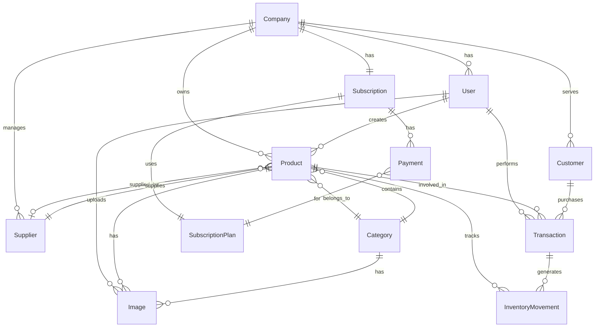

# Entidades do Sistema Estoque Mestre

## 📋 Visão Geral

Este documento detalha todas as entidades do sistema Estoque Mestre, suas responsabilidades, relacionamentos e funcionalidades. As entidades estão organizadas em camadas seguindo os princípios de Domain-Driven Design (DDD).

## 🏗️ Estrutura das Entidades

### Localização
- **Entidades**: `packages/models/src/entity/`
- **Interfaces**: `packages/models/src/interfaces/`
- **DTOs**: `packages/models/src/dto/`
- **Views**: `packages/models/src/view/`

## 📦 Entidades Principais

### 1. **Company** - Empresa
**Arquivo**: `company.entity.ts`

**Responsabilidades**:
- Representa uma empresa cadastrada no sistema
- Gerencia dados da empresa e status de aprovação
- Controla acesso e permissões

**Campos Principais**:
```typescript
interface Company {
  id: string;
  name: string;
  cnpj: string;
  email: string;
  phone: string;
  address: CompanyAddress;
  status: CompanyStatus; // PENDING, APPROVED, REJECTED, SUSPENDED
  subscriptionId?: string;
  createdAt: Date;
  updatedAt: Date;
}
```

**Status da Empresa**:
- `PENDING`: Aguardando aprovação do admin
- `APPROVED`: Aprovada e ativa
- `REJECTED`: Rejeitada pelo admin
- `SUSPENDED`: Suspensa por inadimplência

### 2. **User** - Usuário
**Arquivo**: `user.entity.ts`

**Responsabilidades**:
- Representa usuários do sistema (Admin e Business)
- Gerencia autenticação e autorização
- Controla permissões por empresa

**Tipos de Usuário**:
- `ADMIN`: Administrador do sistema
- `BUSINESS`: Usuário da empresa

### 3. **Product** - Produto
**Arquivo**: `product.entity.ts`

**Responsabilidades**:
- Representa produtos do estoque
- Gerencia preços, estoque e especificações
- Integra com sistema de imagens

**Funcionalidades**:
- ✅ CRUD completo de produtos
- ✅ Gestão de estoque
- ✅ Múltiplas imagens (máx. 5)
- ✅ Especificações técnicas
- ✅ Compatibilidade (para motopeças)
- ✅ Kits e sub-itens

### 4. **Image** - Imagem
**Arquivo**: `image.entity.ts`

**Responsabilidades**:
- Gerencia upload e armazenamento no MinIO
- Processa múltiplas variantes de imagem
- Integra com entidades do sistema

**Tipos de Imagem**:
- `PRODUCT_IMAGE`: Imagem de produto
- `USER_AVATAR`: Avatar do usuário
- `COMPANY_LOGO`: Logo da empresa
- `BRAND_LOGO`: Logo da marca
- `CATEGORY_IMAGE`: Imagem da categoria

### 5. **Category** - Categoria
**Arquivo**: `category.entity.ts`

**Responsabilidades**:
- Organiza produtos em categorias
- Suporta hierarquia de categorias
- Gerencia especificações por categoria

### 6. **Supplier** - Fornecedor
**Arquivo**: `supplier.entity.ts`

**Responsabilidades**:
- Representa fornecedores de produtos
- Gerencia informações de contato
- Controla relacionamento com produtos

### 7. **Customer** - Cliente
**Arquivo**: `customer.entity.ts`

**Responsabilidades**:
- Representa clientes da empresa
- Gerencia informações de contato
- Controla histórico de transações

### 8. **Transaction** - Transação
**Arquivo**: `transaction.entity.ts`

**Responsabilidades**:
- Registra movimentações de estoque
- Controla entrada e saída de produtos
- Gera histórico de movimentações

**Tipos de Transação**:
- `IN`: Entrada de estoque
- `OUT`: Saída de estoque
- `ADJUSTMENT`: Ajuste de estoque
- `TRANSFER`: Transferência entre locais

### 9. **InventoryMovement** - Movimentação de Estoque
**Arquivo**: `inventory-movement.entity.ts`

**Responsabilidades**:
- Detalha movimentações específicas
- Registra motivos e responsáveis
- Integra com sistema de auditoria

## 💳 Entidades de Pagamento (Novas)

### 10. **Subscription** - Assinatura
**Arquivo**: `subscription.entity.ts`

**Responsabilidades**:
- Gerencia assinaturas das empresas
- Controla status de pagamento
- Integra com Stripe

**Status da Assinatura**:
- `ACTIVE`: Ativa e em dia
- `INACTIVE`: Inativa
- `CANCELED`: Cancelada
- `PAST_DUE`: Em atraso
- `UNPAID`: Não paga

### 11. **SubscriptionPlan** - Plano de Assinatura
**Arquivo**: `subscription-plan.entity.ts`

**Responsabilidades**:
- Define planos disponíveis
- Gerencia preços e funcionalidades
- Controla promoções e descontos

**Plano Atual**:
- **Valor**: R$ 150,00/mês
- **Funcionalidades**: Completas
- **Suporte**: Email e chat

### 12. **Payment** - Pagamento
**Arquivo**: `payment.entity.ts`

**Responsabilidades**:
- Registra transações de pagamento
- Integra com Stripe
- Controla status de pagamento

**Status do Pagamento**:
- `PENDING`: Pendente
- `PROCESSING`: Processando
- `SUCCEEDED`: Pago
- `FAILED`: Falhou
- `REFUNDED`: Reembolsado

## 🔄 Relacionamentos entre Entidades

### Diagrama de Relacionamentos



## 📊 DTOs por Entidade

### Request DTOs
- `CreateCompanyRequestDto`
- `UpdateCompanyRequestDto`
- `CreateProductRequestDto`
- `UpdateProductRequestDto`
- `CreateUserRequestDto`
- `CreateSubscriptionRequestDto`
- `CreatePaymentRequestDto`

### Response DTOs
- `CompanyResponseDto`
- `ProductResponseDto`
- `UserResponseDto`
- `SubscriptionResponseDto`
- `PaymentResponseDto`

## 🎯 View Layer por Entidade

### Views Principais
- `CompanyListView`
- `ProductListView`
- `ProductDetailView`
- `UserListView`
- `SubscriptionDashboardView`
- `PaymentHistoryView`

## 🔧 Funcionalidades por Entidade

### Company
- ✅ Cadastro e aprovação
- ✅ Gestão de dados
- ✅ Controle de status
- ✅ Integração com assinatura

### Product
- ✅ CRUD completo
- ✅ Gestão de imagens (máx. 5)
- ✅ Controle de estoque
- ✅ Especificações técnicas
- ✅ Compatibilidade

### User
- ✅ Autenticação
- ✅ Autorização por empresa
- ✅ Gestão de permissões
- ✅ Perfil e avatar

### Subscription
- ✅ Gestão de assinaturas
- ✅ Controle de pagamentos
- ✅ Bloqueio por inadimplência
- ✅ Renovação automática

### Payment
- ✅ Processamento via Stripe
- ✅ Controle de status
- ✅ Histórico de pagamentos
- ✅ Reembolsos

## 🚀 APIs por Entidade

### Endpoints Principais

#### Company
```
GET    /api/companies
POST   /api/companies
GET    /api/companies/:id
PUT    /api/companies/:id
DELETE /api/companies/:id
POST   /api/companies/:id/approve
POST   /api/companies/:id/reject
```

#### Product
```
GET    /api/products
POST   /api/products
GET    /api/products/:id
PUT    /api/products/:id
DELETE /api/products/:id
POST   /api/products/:id/images
PUT    /api/products/:id/images/order
DELETE /api/products/:id/images/:imageId
```

#### Subscription
```
GET    /api/subscriptions
POST   /api/subscriptions
GET    /api/subscriptions/:id
PUT    /api/subscriptions/:id
POST   /api/subscriptions/:id/cancel
POST   /api/subscriptions/:id/reactivate
```

#### Payment
```
GET    /api/payments
POST   /api/payments
GET    /api/payments/:id
POST   /api/payments/:id/refund
GET    /api/payments/subscription/:subscriptionId
```

## 🔒 Validações e Regras de Negócio

### Company
- CNPJ deve ser válido e único
- Email deve ser único
- Status deve seguir fluxo de aprovação

### Product
- SKU deve ser único por empresa
- Estoque não pode ser negativo
- Máximo 5 imagens por produto
- Preço de venda deve ser maior que custo

### Subscription
- Apenas uma assinatura ativa por empresa
- Pagamento deve ser processado antes do vencimento
- Bloqueio automático após 11 dias de atraso

### Payment
- Valor deve corresponder ao plano
- Status deve seguir fluxo do Stripe
- Reembolsos não podem exceder valor pago

## 📈 Métricas e Analytics

### Por Entidade
- **Company**: Total de empresas, taxa de aprovação
- **Product**: Total de produtos, produtos com estoque baixo
- **User**: Usuários ativos, novos cadastros
- **Subscription**: Receita recorrente, taxa de churn
- **Payment**: Taxa de sucesso, inadimplência

---

Esta documentação serve como guia completo para o desenvolvimento e manutenção do sistema Estoque Mestre, garantindo consistência e qualidade em todas as camadas.
