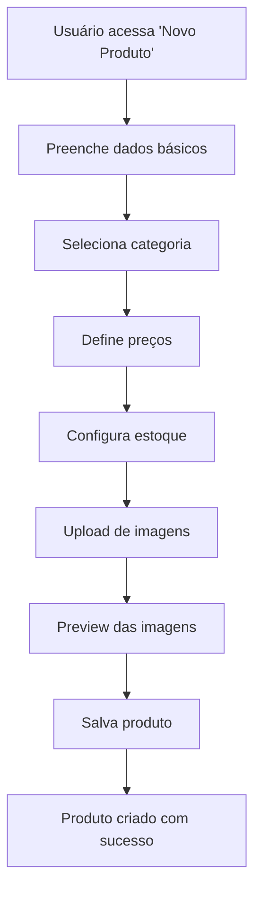
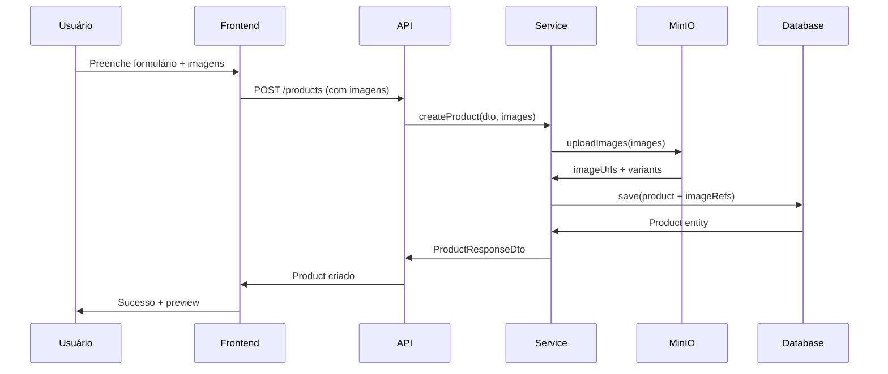
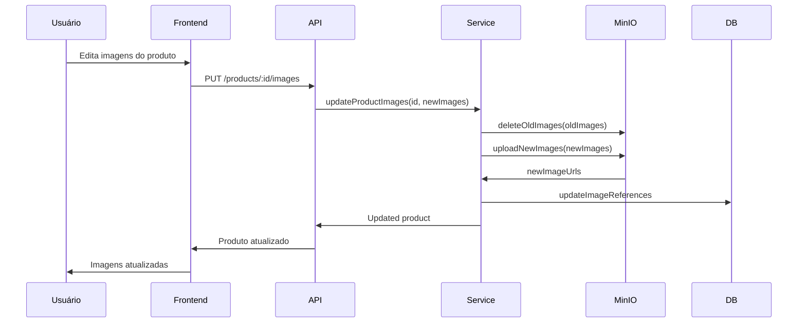

# Sistema de Gestão de Produtos e Imagens

## 📋 Visão Geral

O sistema Estoque Mestre oferece uma solução completa e intuitiva para gestão de produtos com integração ao MinIO para armazenamento de imagens. O usuário pode cadastrar, editar e gerenciar seus produtos de forma simples e eficiente.

## 🏗️ Arquitetura do Sistema de Produtos

### Entidades Principais

#### 1. **Product Entity** (Core)
**Localização**: `packages/models/src/entity/product.entity.ts`

**Responsabilidades**:
- Define a estrutura completa do produto
- Gerencia inventário e estoque
- Controla preços e especificações
- Integra com sistema de imagens

**Estrutura Principal**:
```typescript
export class Product {
  // Identificação
  id: string;
  name: string;
  sku: string;
  barcode?: string;
  
  // Status e tipo
  status: ProductStatus;
  type: ProductType;
  
  // Relacionamentos
  companyId: string;
  categoryId: string;
  supplierId?: string;
  
  // Dados do produto
  specifications: IProductSpecification[];
  images: IProductImage[];        // 🖼️ Máximo 5 imagens
  attachments: IProductAttachment[];
  pricing: IProductPricing;
  inventory: IProductInventory;
  compatibility: IProductCompatibility;
  
  // Kit/SubItems
  isKit: boolean;
  subItems: IProductSubItem[];
  kitDetails?: IProductKit;
}
```

#### 2. **Image Entity** (MinIO Integration)
**Localização**: `packages/models/src/entity/image.entity.ts`

**Responsabilidades**:
- Gerencia upload e armazenamento no MinIO
- Processa múltiplas variantes de imagem
- Controla metadados e otimizações
- Integra com entidades do sistema

## 🖼️ Sistema de Imagens com MinIO

### Configuração do MinIO

```typescript
// Configuração MinIO
const minioConfig = {
  endPoint: process.env.MINIO_ENDPOINT,
  port: parseInt(process.env.MINIO_PORT),
  useSSL: process.env.MINIO_USE_SSL === 'true',
  accessKey: process.env.MINIO_ACCESS_KEY,
  secretKey: process.env.MINIO_SECRET_KEY,
  bucketName: process.env.MINIO_BUCKET_NAME
};
```

### Tipos de Imagem Suportados

```typescript
enum ImageType {
  PRODUCT_IMAGE = 'PRODUCT_IMAGE',           // Imagem principal do produto
  PRODUCT_ATTACHMENT = 'PRODUCT_ATTACHMENT', // Anexos do produto
  USER_AVATAR = 'USER_AVATAR',               // Avatar do usuário
  COMPANY_LOGO = 'COMPANY_LOGO',             // Logo da empresa
  BRAND_LOGO = 'BRAND_LOGO',                 // Logo da marca
  CATEGORY_IMAGE = 'CATEGORY_IMAGE',         // Imagem da categoria
  VEHICLE_IMAGE = 'VEHICLE_IMAGE'            // Imagem do veículo
}
```

### Variantes de Imagem Geradas

```typescript
interface IImageVariants {
  original: { url: string; size: number };
  thumbnail?: { url: string; size: number; width: number; height: number };
  small?: { url: string; size: number; width: number; height: number };
  medium?: { url: string; size: number; width: number; height: number };
  large?: { url: string; size: number; width: number; height: number };
  xlarge?: { url: string; size: number; width: number; height: number };
}
```

### Processamento Automático

1. **Upload Original**: Imagem enviada pelo usuário
2. **Validação**: Formato, tamanho, dimensões
3. **Processamento**: Geração de variantes otimizadas
4. **Armazenamento**: Upload para MinIO
5. **Metadados**: Extração e armazenamento de informações

## 📱 Interface de Usuário - Gestão de Produtos

### Fluxo de Cadastro de Produto



### Componentes da Interface

#### 1. **Formulário de Produto**
```typescript
interface ProductForm {
  // Dados básicos
  name: string;
  description?: string;
  sku: string;
  barcode?: string;
  
  // Categorização
  categoryId: string;
  brand?: string;
  model?: string;
  
  // Preços
  costPrice: number;
  sellingPrice: number;
  
  // Estoque
  currentStock: number;
  minStock: number;
  maxStock?: number;
  
  // Imagens (máximo 5)
  images: File[];
}
```

#### 2. **Upload de Imagens**
```typescript
interface ImageUploadComponent {
  maxFiles: 5;
  maxFileSize: '10MB';
  acceptedFormats: ['jpg', 'jpeg', 'png', 'webp'];
  features: [
    'Drag & Drop',
    'Preview em tempo real',
    'Redimensionamento automático',
    'Compressão otimizada',
    'Reordenação por drag'
  ];
}
```

### Funcionalidades de Imagem

#### 1. **Upload Múltiplo**
- ✅ Máximo 5 imagens por produto
- ✅ Drag & drop interface
- ✅ Preview em tempo real
- ✅ Validação de formato e tamanho
- ✅ Compressão automática

#### 2. **Edição de Imagens**
- ✅ Reordenação por drag & drop
- ✅ Definição de imagem principal
- ✅ Remoção individual
- ✅ Substituição de imagens
- ✅ Redimensionamento manual

#### 3. **Otimizações Automáticas**
- ✅ Geração de thumbnails
- ✅ Múltiplas resoluções
- ✅ Compressão WebP
- ✅ Lazy loading
- ✅ CDN integration

## 🔄 Fluxo de Dados - Produto com Imagens

### 1. **Criação de Produto**



### 2. **Edição de Imagens**



## 📊 DTOs para Gestão de Produtos

### Request DTOs

#### 1. **CreateProductRequestDto**
```typescript
export class CreateProductRequestDto {
  @IsString()
  @IsNotEmpty()
  name: string;

  @IsString()
  @IsOptional()
  description?: string;

  @IsString()
  @IsNotEmpty()
  sku: string;

  @IsString()
  @IsOptional()
  barcode?: string;

  @IsString()
  @IsNotEmpty()
  categoryId: string;

  @IsNumber()
  @IsPositive()
  costPrice: number;

  @IsNumber()
  @IsPositive()
  sellingPrice: number;

  @IsNumber()
  @Min(0)
  currentStock: number;

  @IsNumber()
  @Min(0)
  minStock: number;

  @IsArray()
  @ArrayMaxSize(5)
  @ValidateNested({ each: true })
  @Type(() => ImageUploadDto)
  images?: ImageUploadDto[];
}
```

#### 2. **ImageUploadDto**
```typescript
export class ImageUploadDto {
  @IsString()
  @IsNotEmpty()
  filename: string;

  @IsString()
  @IsNotEmpty()
  mimeType: string;

  @IsNumber()
  @IsPositive()
  size: number;

  @IsString()
  @IsOptional()
  type?: 'MAIN' | 'DETAIL' | 'GALLERY';

  @IsBoolean()
  @IsOptional()
  isPrimary?: boolean;
}
```

### Response DTOs

#### 1. **ProductResponseDto**
```typescript
export class ProductResponseDto {
  id: string;
  name: string;
  description?: string;
  sku: string;
  barcode?: string;
  status: ProductStatus;
  type: ProductType;
  
  // Pricing
  costPrice: number;
  sellingPrice: number;
  margin: number;
  
  // Inventory
  currentStock: number;
  minStock: number;
  inventoryStatus: InventoryStatus;
  
  // Images
  images: ProductImageResponseDto[];
  primaryImage?: ProductImageResponseDto;
  
  // Metadata
  createdAt: Date;
  updatedAt: Date;
}
```

#### 2. **ProductImageResponseDto**
```typescript
export class ProductImageResponseDto {
  id: string;
  type: 'MAIN' | 'DETAIL' | 'GALLERY';
  isPrimary: boolean;
  order: number;
  
  // URLs para diferentes tamanhos
  thumbnailUrl: string;
  smallUrl: string;
  mediumUrl: string;
  largeUrl: string;
  originalUrl: string;
  
  // Metadados
  filename: string;
  mimeType: string;
  size: number;
  width?: number;
  height?: number;
  
  uploadedAt: Date;
}
```

## 🎯 View Layer para Produtos

### 1. **ProductListView**
```typescript
export class ProductListView {
  id: string;
  name: string;
  sku: string;
  status: ProductStatus;
  
  // Pricing
  costPrice: number;
  sellingPrice: number;
  margin: number;
  
  // Inventory
  currentStock: number;
  inventoryStatus: InventoryStatus;
  
  // Images
  primaryImageUrl?: string;
  imageCount: number;
  
  // Category
  categoryName: string;
  
  // Supplier
  supplierName?: string;
  
  // Dates
  createdAt: Date;
  lastMovement?: Date;
}
```

### 2. **ProductDetailView**
```typescript
export class ProductDetailView {
  // Basic info
  id: string;
  name: string;
  description?: string;
  sku: string;
  barcode?: string;
  
  // Complete pricing
  pricing: {
    costPrice: number;
    sellingPrice: number;
    margin: number;
    marginPercentage: number;
  };
  
  // Complete inventory
  inventory: {
    currentStock: number;
    minStock: number;
    maxStock?: number;
    status: InventoryStatus;
    lastMovement?: Date;
  };
  
  // All images with variants
  images: ProductImageDetailView[];
  
  // Category and supplier
  category: {
    id: string;
    name: string;
  };
  supplier?: {
    id: string;
    name: string;
  };
  
  // Specifications
  specifications: ProductSpecificationView[];
  
  // Compatibility (for auto parts)
  compatibility?: {
    vehicleMake?: string;
    vehicleModel?: string;
    vehicleYear?: string;
  };
}
```

## 🔧 APIs para Gestão de Produtos

### Endpoints Principais

#### 1. **Produtos**
```typescript
// Listar produtos
GET /api/products
Query: { page, limit, search, category, status, lowStock }

// Buscar produto por ID
GET /api/products/:id

// Criar produto
POST /api/products
Body: CreateProductRequestDto

// Atualizar produto
PUT /api/products/:id
Body: UpdateProductRequestDto

// Deletar produto
DELETE /api/products/:id

// Buscar por SKU
GET /api/products/sku/:sku

// Buscar por código de barras
GET /api/products/barcode/:barcode
```

#### 2. **Imagens de Produtos**
```typescript
// Upload de imagens
POST /api/products/:id/images
Body: FormData (múltiplas imagens)

// Atualizar ordem das imagens
PUT /api/products/:id/images/order
Body: { imageIds: string[] }

// Definir imagem principal
PUT /api/products/:id/images/:imageId/primary

// Remover imagem
DELETE /api/products/:id/images/:imageId

// Obter URL de upload direto
GET /api/products/:id/images/upload-url
```

#### 3. **Inventário**
```typescript
// Atualizar estoque
PUT /api/products/:id/inventory
Body: { currentStock: number, minStock: number }

// Movimentação de estoque
POST /api/products/:id/movements
Body: { type: 'IN' | 'OUT', quantity: number, reason: string }

// Histórico de movimentações
GET /api/products/:id/movements
Query: { page, limit, type, dateFrom, dateTo }
```

## 📱 Interface do Usuário - Detalhes

### 1. **Tela de Listagem de Produtos**

**Funcionalidades**:
- ✅ Lista paginada de produtos
- ✅ Filtros por categoria, status, estoque baixo
- ✅ Busca por nome, SKU ou código de barras
- ✅ Ordenação por nome, preço, estoque, data
- ✅ Preview da imagem principal
- ✅ Indicadores visuais de status

**Componentes**:
```typescript
interface ProductListComponent {
  // Filtros
  filters: {
    search: string;
    category: string;
    status: ProductStatus[];
    lowStock: boolean;
  };
  
  // Ordenação
  sortBy: 'name' | 'price' | 'stock' | 'createdAt';
  sortOrder: 'asc' | 'desc';
  
  // Paginação
  page: number;
  pageSize: number;
  totalItems: number;
  
  // Ações
  actions: [
    'view', 'edit', 'delete', 'duplicate'
  ];
}
```

### 2. **Tela de Cadastro/Edição de Produto**

**Seções**:
1. **Dados Básicos**: Nome, descrição, SKU, código de barras
2. **Categorização**: Categoria, marca, modelo
3. **Preços**: Preço de custo, preço de venda
4. **Estoque**: Estoque atual, estoque mínimo
5. **Imagens**: Upload e gerenciamento (máx. 5)
6. **Especificações**: Detalhes técnicos
7. **Compatibilidade**: Para peças automotivas

**Upload de Imagens**:
```typescript
interface ImageUploadSection {
  // Limites
  maxFiles: 5;
  maxFileSize: '10MB';
  acceptedTypes: ['image/jpeg', 'image/png', 'image/webp'];
  
  // Funcionalidades
  features: [
    'Drag & Drop',
    'Preview em tempo real',
    'Reordenação',
    'Definir principal',
    'Remoção individual',
    'Compressão automática'
  ];
  
  // Estados
  states: {
    uploading: boolean;
    processing: boolean;
    error?: string;
  };
}
```

### 3. **Tela de Detalhes do Produto**

**Informações Exibidas**:
- ✅ Dados completos do produto
- ✅ Galeria de imagens com zoom
- ✅ Histórico de movimentações
- ✅ Gráficos de estoque
- ✅ Especificações técnicas
- ✅ Compatibilidade (se aplicável)

## 🚀 Performance e Otimizações

### 1. **Otimizações de Imagem**
- ✅ Lazy loading para imagens
- ✅ WebP com fallback para JPEG/PNG
- ✅ CDN para entrega global
- ✅ Compressão automática
- ✅ Múltiplas resoluções

### 2. **Otimizações de API**
- ✅ Paginação em todas as listagens
- ✅ Filtros otimizados no banco
- ✅ Cache de consultas frequentes
- ✅ Índices otimizados
- ✅ Queries N+1 prevention

### 3. **Otimizações de Frontend**
- ✅ Virtual scrolling para listas grandes
- ✅ Debounce em buscas
- ✅ Cache de dados no cliente
- ✅ Lazy loading de componentes
- ✅ Otimização de re-renders

## 🔒 Validações e Segurança

### 1. **Validações de Upload**
```typescript
const imageValidation = {
  maxFiles: 5,
  maxFileSize: 10 * 1024 * 1024, // 10MB
  allowedTypes: ['image/jpeg', 'image/png', 'image/webp'],
  maxDimensions: { width: 4000, height: 4000 },
  minDimensions: { width: 100, height: 100 }
};
```

### 2. **Segurança**
- ✅ Validação de tipos MIME
- ✅ Sanitização de nomes de arquivo
- ✅ Verificação de assinatura de arquivo
- ✅ Rate limiting no upload
- ✅ Isolamento por empresa

### 3. **Backup e Recuperação**
- ✅ Backup automático do MinIO
- ✅ Versionamento de imagens
- ✅ Recuperação de arquivos deletados
- ✅ Replicação geográfica

---

Este sistema oferece uma solução completa e intuitiva para gestão de produtos com imagens, permitindo que o usuário gerencie seu estoque de forma eficiente e visual.
