# Fluxos de Negócio - Estoque Mestre

## 📋 Visão Geral

Este documento detalha todos os fluxos de negócio do sistema Estoque Mestre, desde o cadastro da empresa até a gestão completa do estoque.

## 🏢 Fluxo de Cadastro e Aprovação de Empresa

### 1. **Cadastro Inicial da Empresa**

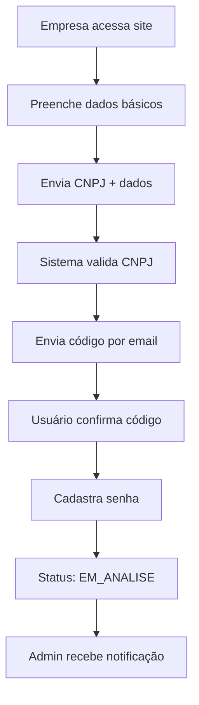

**Dados Obrigatórios**:
- Nome da empresa
- CNPJ (validado)
- Email do responsável
- Telefone
- Endereço completo
- Nome do responsável

**Validações**:
- CNPJ deve ser válido e único
- Email deve ser único
- Telefone deve ser válido
- Endereço deve ser completo

### 2. **Processo de Aprovação**

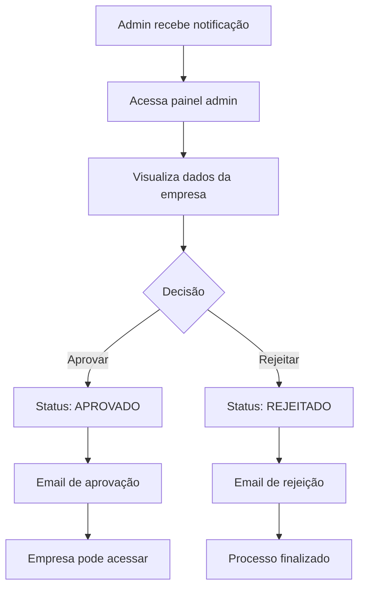

**Critérios de Aprovação**:
- CNPJ válido e ativo
- Dados completos e consistentes
- Email válido e acessível
- Não estar em lista de bloqueio

## 💳 Fluxo de Pagamento e Assinatura

### 1. **Configuração de Pagamento**

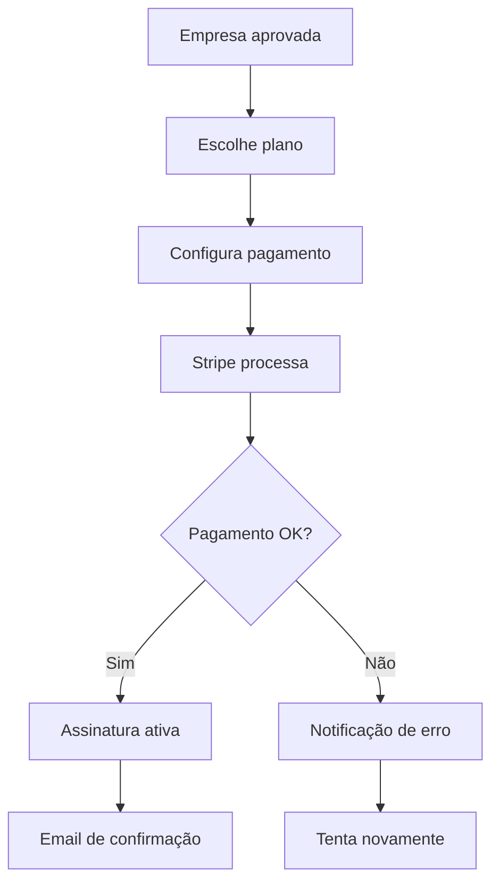

**Plano Atual**:
- **Valor**: R$ 150,00/mês
- **Método**: Cartão de crédito
- **Recorrência**: Mensal
- **Trial**: 7 dias grátis

### 2. **Controle de Inadimplência**

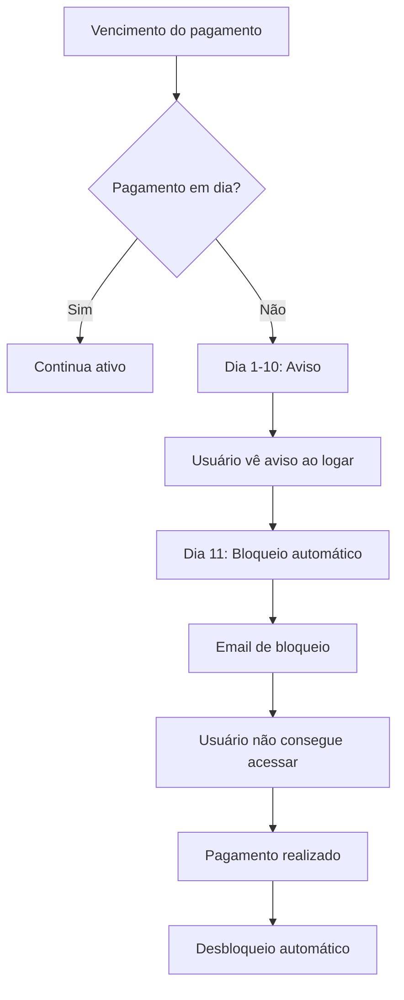

**Regras de Bloqueio**:
- **Dias 1-10**: Aviso visual no sistema
- **Dia 11**: Bloqueio automático
- **Após pagamento**: Desbloqueio imediato
- **Tentativas**: Máximo 3 tentativas de cobrança

## 📦 Fluxo de Gestão de Produtos

### 1. **Cadastro de Produto**

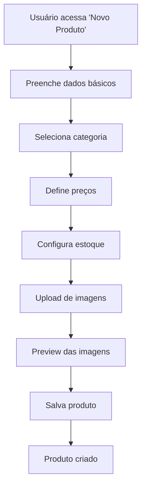

**Dados do Produto**:
- Nome e descrição
- SKU (único por empresa)
- Código de barras (opcional)
- Categoria
- Preço de custo e venda
- Estoque inicial e mínimo
- Especificações técnicas
- Imagens (máximo 5)

### 2. **Upload e Gestão de Imagens**

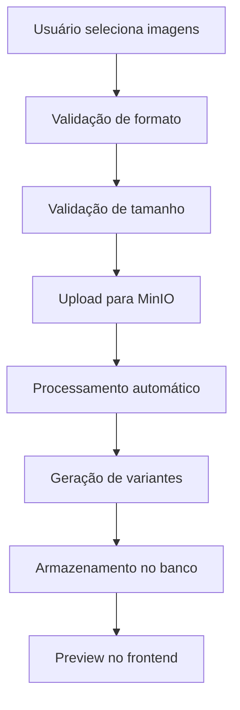

**Limites de Imagem**:
- **Máximo**: 5 imagens por produto
- **Tamanho**: 10MB por imagem
- **Formatos**: JPG, PNG, WebP
- **Variantes**: Thumbnail, Small, Medium, Large, Original

### 3. **Movimentação de Estoque**

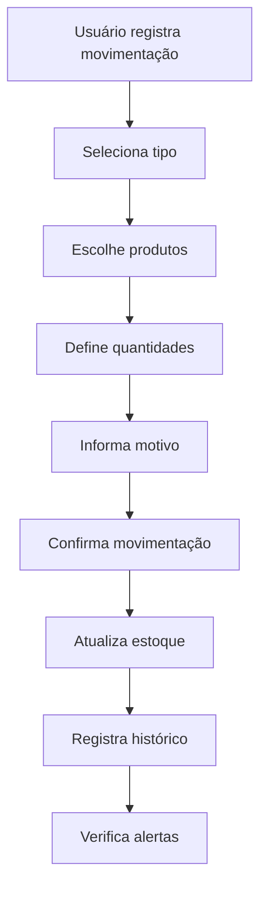

**Tipos de Movimentação**:
- **Entrada**: Compra, devolução, ajuste positivo
- **Saída**: Venda, perda, ajuste negativo
- **Transferência**: Entre locais
- **Inventário**: Contagem física

## 🔍 Fluxo de Relatórios e Analytics

### 1. **Geração de Relatórios**

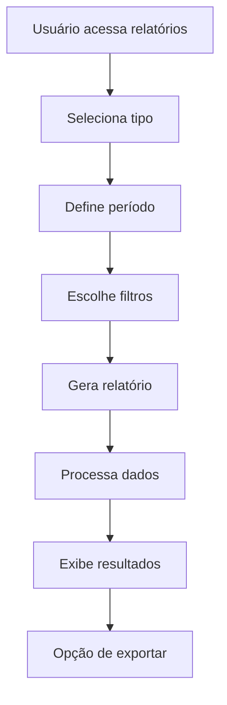

**Tipos de Relatório**:
- **Estoque**: Produtos em estoque, baixo estoque
- **Movimentação**: Entradas e saídas
- **Vendas**: Produtos mais vendidos
- **Financeiro**: Margem de lucro, custos
- **Fornecedores**: Performance de fornecedores

### 2. **Dashboard Executivo**

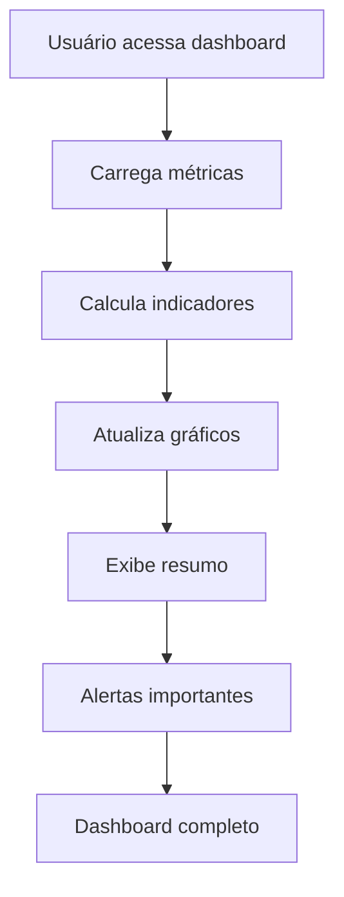

**Métricas Principais**:
- Total de produtos
- Valor do estoque
- Produtos com estoque baixo
- Movimentações do dia
- Receita do período

## 👥 Fluxo de Gestão de Usuários

### 1. **Cadastro de Usuário**

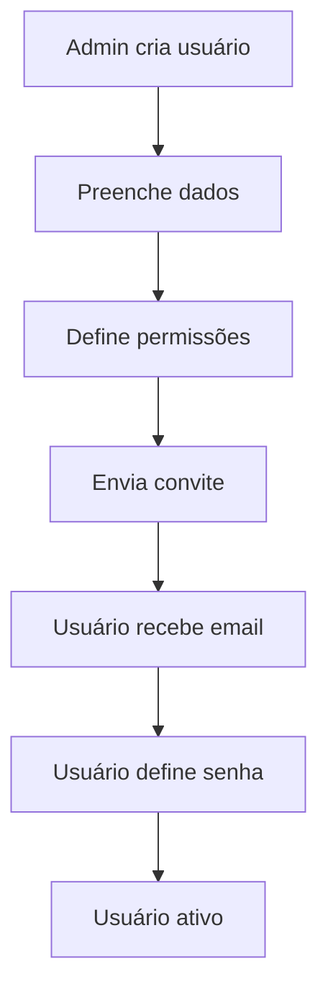

**Tipos de Usuário**:
- **Admin**: Acesso total ao sistema
- **Business**: Acesso limitado à empresa
- **Viewer**: Apenas visualização
- **Operator**: Operações básicas

### 2. **Controle de Permissões**

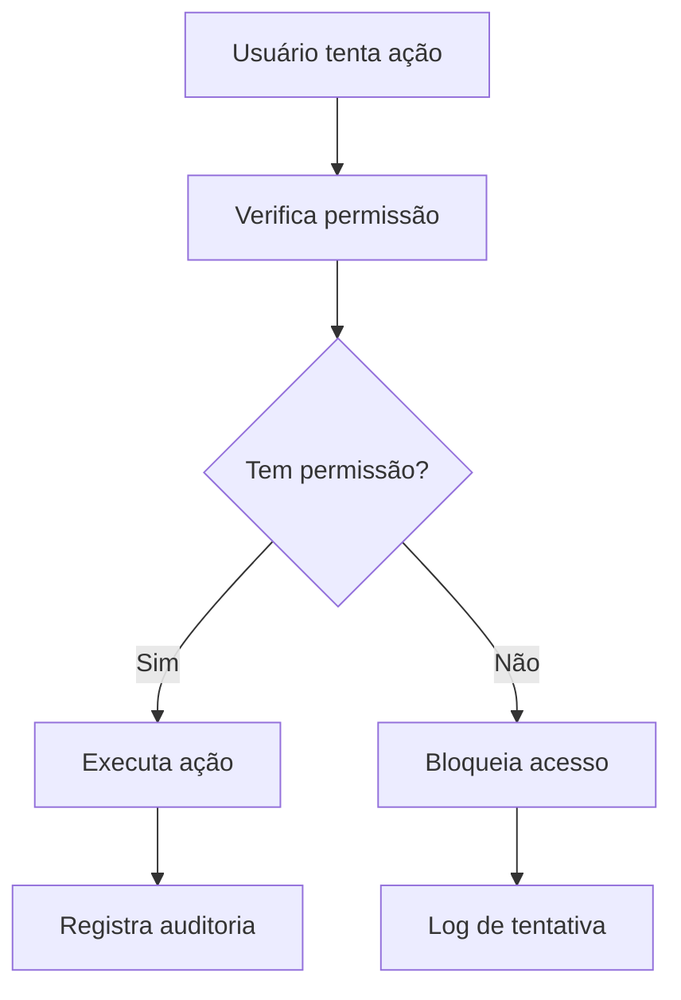

## 🔐 Fluxo de Autenticação e Segurança

### 1. **Login do Usuário**

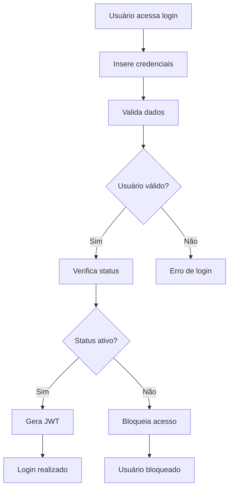

### 2. **Controle de Sessão**

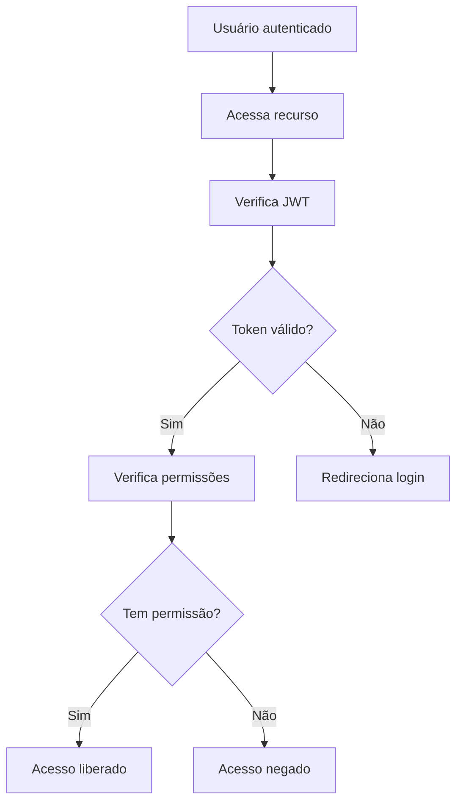

## 📱 Fluxo de Notificações

### 1. **Sistema de Alertas**

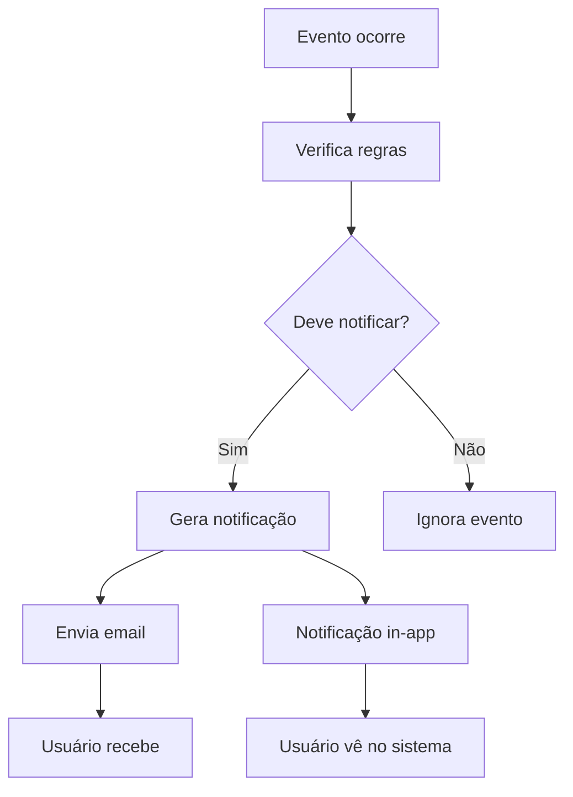

**Tipos de Notificação**:
- **Estoque baixo**: Produtos com estoque mínimo
- **Pagamento**: Lembretes de vencimento
- **Sistema**: Manutenções, atualizações
- **Segurança**: Tentativas de acesso

## 🔄 Fluxo de Backup e Recuperação

### 1. **Backup Automático**

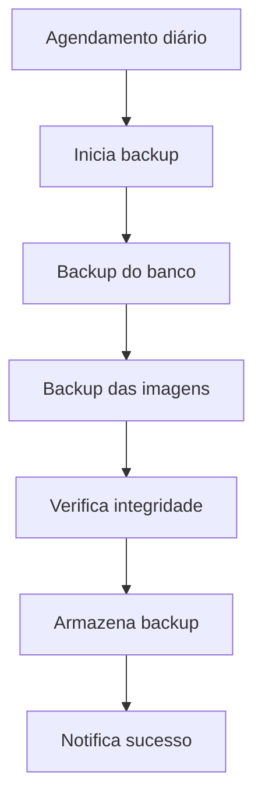

### 2. **Recuperação de Dados**

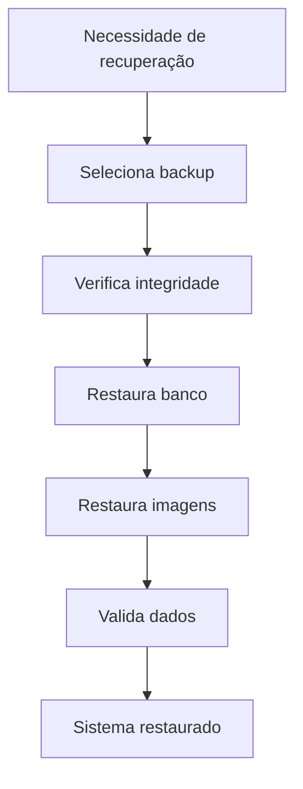

## 📊 Fluxo de Analytics e Métricas

### 1. **Coleta de Dados**

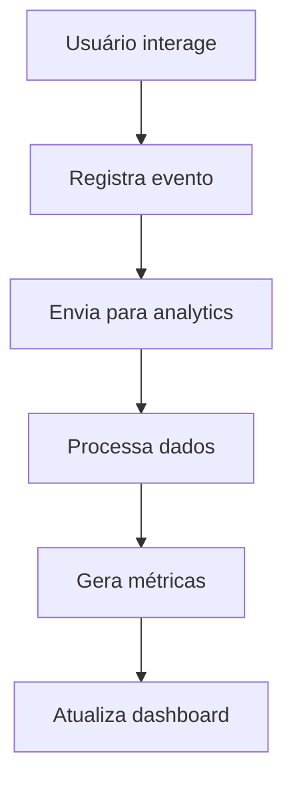

**Métricas Coletadas**:
- Ações do usuário
- Tempo de sessão
- Produtos mais acessados
- Funcionalidades mais usadas
- Performance do sistema

---

Estes fluxos garantem que o sistema Estoque Mestre funcione de forma eficiente, segura e intuitiva para todos os usuários.
