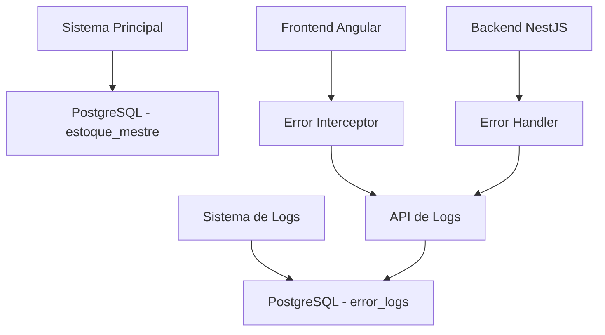

# Módulo de Logs de Erro - Sistema de Monitoramento

## 📋 Visão Geral

O módulo de logs de erro é um sistema independente que captura, processa e armazena todos os erros que ocorrem no frontend e backend do Estoque Mestre. Este sistema utiliza um banco de dados separado para garantir que os logs não interfiram no funcionamento principal do sistema.

## 🏗️ Arquitetura do Sistema de Logs

### Separação de Bancos de Dados



### Estrutura do Módulo

```
error-logging/
├── database/
│   ├── schema.sql              # Schema do banco de logs
│   ├── migrations/             # Migrações específicas
│   └── seeders/               # Dados iniciais
├── entities/
│   ├── error-log.entity.ts    # Entidade principal
│   ├── error-context.entity.ts # Contexto do erro
│   └── error-stack.entity.ts  # Stack trace
├── dto/
│   ├── request/
│   │   └── create-error-log.request.dto.ts
│   └── response/
│       └── error-log.response.dto.ts
├── services/
│   ├── error-logger.service.ts # Serviço principal
│   ├── error-processor.service.ts # Processamento
│   └── error-analytics.service.ts # Analytics
└── controllers/
    └── error-log.controller.ts # API endpoints
```

## 🗄️ Banco de Dados de Logs

### Configuração Separada

```typescript
// Configuração do banco de logs
const errorLogsConfig = {
  type: 'postgres',
  host: process.env.ERROR_LOGS_DB_HOST,
  port: parseInt(process.env.ERROR_LOGS_DB_PORT),
  username: process.env.ERROR_LOGS_DB_USER,
  password: process.env.ERROR_LOGS_DB_PASSWORD,
  database: process.env.ERROR_LOGS_DB_NAME,
  entities: [ErrorLog, ErrorContext, ErrorStack],
  synchronize: false,
  logging: false
};
```

### Schema do Banco de Logs

```sql
-- Tabela principal de logs de erro
CREATE TABLE error_logs (
    id UUID PRIMARY KEY DEFAULT gen_random_uuid(),
    error_id VARCHAR(255) UNIQUE NOT NULL,
    timestamp TIMESTAMP WITH TIME ZONE DEFAULT NOW(),
    
    -- Informações do erro
    error_type VARCHAR(100) NOT NULL,
    error_message TEXT NOT NULL,
    error_code VARCHAR(50),
    severity VARCHAR(20) NOT NULL, -- CRITICAL, HIGH, MEDIUM, LOW
    
    -- Origem do erro
    source VARCHAR(50) NOT NULL, -- FRONTEND, BACKEND, API, DATABASE
    component VARCHAR(100), -- Nome do componente/rota
    user_agent TEXT,
    url TEXT,
    method VARCHAR(10),
    
    -- Contexto do usuário
    user_id UUID,
    company_id UUID,
    session_id VARCHAR(255),
    
    -- Informações técnicas
    browser_info JSONB,
    device_info JSONB,
    network_info JSONB,
    
    -- Status do processamento
    status VARCHAR(20) DEFAULT 'PENDING', -- PENDING, PROCESSED, IGNORED
    processed_at TIMESTAMP WITH TIME ZONE,
    processed_by VARCHAR(100),
    
    -- Metadados
    metadata JSONB,
    tags TEXT[],
    
    created_at TIMESTAMP WITH TIME ZONE DEFAULT NOW(),
    updated_at TIMESTAMP WITH TIME ZONE DEFAULT NOW()
);

-- Tabela de contexto do erro
CREATE TABLE error_contexts (
    id UUID PRIMARY KEY DEFAULT gen_random_uuid(),
    error_log_id UUID REFERENCES error_logs(id) ON DELETE CASCADE,
    
    -- Contexto da aplicação
    route VARCHAR(255),
    component_name VARCHAR(255),
    action VARCHAR(100),
    
    -- Estado da aplicação
    app_state JSONB,
    user_state JSONB,
    form_data JSONB,
    
    -- Performance
    load_time INTEGER,
    memory_usage INTEGER,
    cpu_usage INTEGER,
    
    created_at TIMESTAMP WITH TIME ZONE DEFAULT NOW()
);

-- Tabela de stack traces
CREATE TABLE error_stacks (
    id UUID PRIMARY KEY DEFAULT gen_random_uuid(),
    error_log_id UUID REFERENCES error_logs(id) ON DELETE CASCADE,
    
    -- Stack trace
    stack_trace TEXT NOT NULL,
    stack_frames JSONB,
    
    -- Arquivo e linha
    file_name VARCHAR(500),
    line_number INTEGER,
    column_number INTEGER,
    function_name VARCHAR(255),
    
    created_at TIMESTAMP WITH TIME ZONE DEFAULT NOW()
);

-- Índices para performance
CREATE INDEX idx_error_logs_timestamp ON error_logs(timestamp);
CREATE INDEX idx_error_logs_severity ON error_logs(severity);
CREATE INDEX idx_error_logs_source ON error_logs(source);
CREATE INDEX idx_error_logs_company_id ON error_logs(company_id);
CREATE INDEX idx_error_logs_user_id ON error_logs(user_id);
CREATE INDEX idx_error_logs_status ON error_logs(status);
CREATE INDEX idx_error_logs_error_type ON error_logs(error_type);
```

## 📦 Entidades do Sistema de Logs

### 1. **ErrorLog Entity**

```typescript
/**
 * Error Log entity - Log principal de erros
 */

import { IBaseEntity } from '../interfaces/base.interface';
import { 
  ErrorSeverity, 
  ErrorSource, 
  ErrorStatus,
  IErrorContext,
  IErrorStack,
  IErrorMetadata
} from '../interfaces/error-log.interface';

export class ErrorLog implements IBaseEntity {
  id!: string;
  errorId!: string; // ID único gerado pelo frontend
  
  // Informações do erro
  errorType!: string;
  errorMessage!: string;
  errorCode?: string;
  severity!: ErrorSeverity;
  
  // Origem do erro
  source!: ErrorSource;
  component?: string;
  userAgent?: string;
  url?: string;
  method?: string;
  
  // Contexto do usuário
  userId?: string;
  companyId?: string;
  sessionId?: string;
  
  // Informações técnicas
  browserInfo?: Record<string, any>;
  deviceInfo?: Record<string, any>;
  networkInfo?: Record<string, any>;
  
  // Status do processamento
  status!: ErrorStatus;
  processedAt?: Date;
  processedBy?: string;
  
  // Metadados
  metadata?: IErrorMetadata;
  tags?: string[];
  
  // Relacionamentos
  contexts?: IErrorContext[];
  stacks?: IErrorStack[];
  
  // Timestamps
  timestamp!: Date;
  createdAt!: Date;
  updatedAt!: Date;

  constructor(data: Partial<ErrorLog>) {
    Object.assign(this, data);
  }

  // Status checks
  isPending(): boolean {
    return this.status === ErrorStatus.PENDING;
  }

  isProcessed(): boolean {
    return this.status === ErrorStatus.PROCESSED;
  }

  isIgnored(): boolean {
    return this.status === ErrorStatus.IGNORED;
  }

  // Severity checks
  isCritical(): boolean {
    return this.severity === ErrorSeverity.CRITICAL;
  }

  isHigh(): boolean {
    return this.severity === ErrorSeverity.HIGH;
  }

  isMedium(): boolean {
    return this.severity === ErrorSeverity.MEDIUM;
  }

  isLow(): boolean {
    return this.severity === ErrorSeverity.LOW;
  }

  // Source checks
  isFromFrontend(): boolean {
    return this.source === ErrorSource.FRONTEND;
  }

  isFromBackend(): boolean {
    return this.source === ErrorSource.BACKEND;
  }

  isFromAPI(): boolean {
    return this.source === ErrorSource.API;
  }

  isFromDatabase(): boolean {
    return this.source === ErrorSource.DATABASE;
  }

  // Processing methods
  markAsProcessed(processedBy: string): void {
    this.status = ErrorStatus.PROCESSED;
    this.processedAt = new Date();
    this.processedBy = processedBy;
  }

  markAsIgnored(processedBy: string): void {
    this.status = ErrorStatus.IGNORED;
    this.processedAt = new Date();
    this.processedBy = processedBy;
  }

  // Utility methods
  getFormattedTimestamp(): string {
    return this.timestamp.toISOString();
  }

  getSeverityColor(): string {
    switch (this.severity) {
      case ErrorSeverity.CRITICAL: return 'red';
      case ErrorSeverity.HIGH: return 'orange';
      case ErrorSeverity.MEDIUM: return 'yellow';
      case ErrorSeverity.LOW: return 'green';
      default: return 'gray';
    }
  }

  getSourceIcon(): string {
    switch (this.source) {
      case ErrorSource.FRONTEND: return '🖥️';
      case ErrorSource.BACKEND: return '⚙️';
      case ErrorSource.API: return '🔌';
      case ErrorSource.DATABASE: return '🗄️';
      default: return '❓';
    }
  }

  // Validation
  isValid(): boolean {
    return !!(
      this.errorId &&
      this.errorType &&
      this.errorMessage &&
      this.severity &&
      this.source &&
      this.timestamp
    );
  }
}
```

### 2. **ErrorContext Entity**

```typescript
/**
 * Error Context entity - Contexto do erro
 */

export class ErrorContext implements IBaseEntity {
  id!: string;
  errorLogId!: string;
  
  // Contexto da aplicação
  route?: string;
  componentName?: string;
  action?: string;
  
  // Estado da aplicação
  appState?: Record<string, any>;
  userState?: Record<string, any>;
  formData?: Record<string, any>;
  
  // Performance
  loadTime?: number;
  memoryUsage?: number;
  cpuUsage?: number;
  
  // Timestamps
  createdAt!: Date;
  updatedAt!: Date;

  constructor(data: Partial<ErrorContext>) {
    Object.assign(this, data);
  }
}
```

### 3. **ErrorStack Entity**

```typescript
/**
 * Error Stack entity - Stack trace do erro
 */

export class ErrorStack implements IBaseEntity {
  id!: string;
  errorLogId!: string;
  
  // Stack trace
  stackTrace!: string;
  stackFrames?: Record<string, any>[];
  
  // Arquivo e linha
  fileName?: string;
  lineNumber?: number;
  columnNumber?: number;
  functionName?: string;
  
  // Timestamps
  createdAt!: Date;
  updatedAt!: Date;

  constructor(data: Partial<ErrorStack>) {
    Object.assign(this, data);
  }
}
```

## 🔄 Fluxo de Captura e Envio de Erros

### 1. **Frontend - Interceptor de Erros**

```typescript
// Angular Error Interceptor
@Injectable()
export class ErrorLoggingInterceptor implements HttpInterceptor {
  constructor(
    private errorLoggerService: ErrorLoggerService,
    private router: Router
  ) {}

  intercept(req: HttpRequest<any>, next: HttpHandler): Observable<HttpEvent<any>> {
    return next.handle(req).pipe(
      catchError((error: HttpErrorResponse) => {
        // Captura erro HTTP
        this.logHttpError(error, req);
        return throwError(error);
      })
    );
  }

  private logHttpError(error: HttpErrorResponse, request: HttpRequest<any>): void {
    const errorLog = {
      errorId: this.generateErrorId(),
      errorType: 'HTTP_ERROR',
      errorMessage: error.message,
      errorCode: error.status.toString(),
      severity: this.getSeverityFromStatus(error.status),
      source: 'FRONTEND',
      component: this.getCurrentComponent(),
      url: request.url,
      method: request.method,
      userId: this.getCurrentUserId(),
      companyId: this.getCurrentCompanyId(),
      sessionId: this.getSessionId(),
      browserInfo: this.getBrowserInfo(),
      deviceInfo: this.getDeviceInfo(),
      networkInfo: this.getNetworkInfo(),
      timestamp: new Date(),
      metadata: {
        requestBody: request.body,
        responseBody: error.error,
        headers: request.headers
      }
    };

    this.errorLoggerService.logError(errorLog);
  }
}
```

### 2. **Frontend - Global Error Handler**

```typescript
// Angular Global Error Handler
@Injectable()
export class GlobalErrorHandler implements ErrorHandler {
  constructor(
    private errorLoggerService: ErrorLoggerService,
    private injector: Injector
  ) {}

  handleError(error: any): void {
    // Captura erros JavaScript
    const errorLog = {
      errorId: this.generateErrorId(),
      errorType: 'JAVASCRIPT_ERROR',
      errorMessage: error.message || 'Unknown error',
      errorCode: error.name || 'UNKNOWN',
      severity: this.getSeverityFromError(error),
      source: 'FRONTEND',
      component: this.getCurrentComponent(),
      url: window.location.href,
      userId: this.getCurrentUserId(),
      companyId: this.getCurrentCompanyId(),
      sessionId: this.getSessionId(),
      browserInfo: this.getBrowserInfo(),
      deviceInfo: this.getDeviceInfo(),
      timestamp: new Date(),
      metadata: {
        error: error.toString(),
        stack: error.stack
      }
    };

    this.errorLoggerService.logError(errorLog);
    
    // Log no console para desenvolvimento
    console.error('Error logged:', error);
  }
}
```

### 3. **Frontend - Error Logger Service**

```typescript
// Angular Error Logger Service
@Injectable({
  providedIn: 'root'
})
export class ErrorLoggerService {
  private readonly API_URL = environment.apiUrl + '/error-logs';
  private errorQueue: any[] = [];
  private isProcessing = false;

  constructor(private http: HttpClient) {
    // Processa fila de erros periodicamente
    setInterval(() => this.processQueue(), 5000);
  }

  logError(errorData: any): void {
    // Adiciona à fila
    this.errorQueue.push(errorData);
    
    // Tenta processar imediatamente
    this.processQueue();
  }

  private async processQueue(): Promise<void> {
    if (this.isProcessing || this.errorQueue.length === 0) {
      return;
    }

    this.isProcessing = true;

    try {
      const errors = [...this.errorQueue];
      this.errorQueue = [];

      // Envia em lote
      await this.http.post(this.API_URL + '/batch', { errors }).toPromise();
    } catch (error) {
      console.error('Failed to send error logs:', error);
      // Recoloca na fila para tentar novamente
      this.errorQueue.unshift(...errors);
    } finally {
      this.isProcessing = false;
    }
  }

  private generateErrorId(): string {
    return `err_${Date.now()}_${Math.random().toString(36).substr(2, 9)}`;
  }
}
```

### 4. **Backend - Error Handler**

```typescript
// NestJS Global Exception Filter
@Catch()
export class GlobalExceptionFilter implements ExceptionFilter {
  constructor(
    private errorLoggerService: ErrorLoggerService,
    private logger: Logger
  ) {}

  catch(exception: unknown, host: ArgumentsHost): void {
    const ctx = host.switchToHttp();
    const request = ctx.getRequest();
    const response = ctx.getResponse();

    const errorLog = {
      errorId: this.generateErrorId(),
      errorType: exception.constructor.name,
      errorMessage: exception.message || 'Unknown error',
      errorCode: exception.status?.toString() || '500',
      severity: this.getSeverityFromException(exception),
      source: 'BACKEND',
      component: request.route?.path,
      url: request.url,
      method: request.method,
      userId: request.user?.id,
      companyId: request.user?.companyId,
      sessionId: request.sessionID,
      timestamp: new Date(),
      metadata: {
        requestBody: request.body,
        query: request.query,
        params: request.params,
        headers: request.headers,
        stack: exception.stack
      }
    };

    // Log no sistema de logs
    this.errorLoggerService.logError(errorLog);
    
    // Log local
    this.logger.error('Error occurred:', exception);

    // Resposta para o cliente
    const status = exception.status || 500;
    const message = exception.message || 'Internal server error';
    
    response.status(status).json({
      statusCode: status,
      message,
      timestamp: new Date().toISOString(),
      path: request.url
    });
  }
}
```

## 📊 DTOs para Sistema de Logs

### Request DTOs

#### 1. **CreateErrorLogRequestDto**
```typescript
export class CreateErrorLogRequestDto {
  @IsString()
  @IsNotEmpty()
  errorId: string;

  @IsString()
  @IsNotEmpty()
  errorType: string;

  @IsString()
  @IsNotEmpty()
  errorMessage: string;

  @IsString()
  @IsOptional()
  errorCode?: string;

  @IsEnum(ErrorSeverity)
  severity: ErrorSeverity;

  @IsEnum(ErrorSource)
  source: ErrorSource;

  @IsString()
  @IsOptional()
  component?: string;

  @IsString()
  @IsOptional()
  userAgent?: string;

  @IsString()
  @IsOptional()
  url?: string;

  @IsString()
  @IsOptional()
  method?: string;

  @IsString()
  @IsOptional()
  userId?: string;

  @IsString()
  @IsOptional()
  companyId?: string;

  @IsString()
  @IsOptional()
  sessionId?: string;

  @IsObject()
  @IsOptional()
  browserInfo?: Record<string, any>;

  @IsObject()
  @IsOptional()
  deviceInfo?: Record<string, any>;

  @IsObject()
  @IsOptional()
  networkInfo?: Record<string, any>;

  @IsObject()
  @IsOptional()
  metadata?: Record<string, any>;

  @IsArray()
  @IsOptional()
  tags?: string[];

  @IsDate()
  timestamp: Date;
}
```

### Response DTOs

#### 1. **ErrorLogResponseDto**
```typescript
export class ErrorLogResponseDto {
  id: string;
  errorId: string;
  errorType: string;
  errorMessage: string;
  errorCode?: string;
  severity: ErrorSeverity;
  source: ErrorSource;
  component?: string;
  url?: string;
  method?: string;
  userId?: string;
  companyId?: string;
  sessionId?: string;
  status: ErrorStatus;
  processedAt?: Date;
  processedBy?: string;
  timestamp: Date;
  createdAt: Date;
  updatedAt: Date;
}
```

## 🔧 APIs do Sistema de Logs

### Endpoints Principais

```typescript
// Logs de erro
POST   /api/error-logs              # Criar log individual
POST   /api/error-logs/batch        # Criar logs em lote
GET    /api/error-logs              # Listar logs
GET    /api/error-logs/:id          # Buscar log por ID
PUT    /api/error-logs/:id/status   # Atualizar status
DELETE /api/error-logs/:id          # Deletar log

// Analytics
GET    /api/error-logs/analytics    # Estatísticas
GET    /api/error-logs/trends       # Tendências
GET    /api/error-logs/severity     # Por severidade
GET    /api/error-logs/source       # Por origem

// Dashboard
GET    /api/error-logs/dashboard    # Dashboard de erros
GET    /api/error-logs/recent       # Erros recentes
GET    /api/error-logs/critical     # Erros críticos
```

## 📈 Dashboard de Monitoramento

### Métricas Principais

```typescript
interface ErrorDashboard {
  // Resumo geral
  totalErrors: number;
  criticalErrors: number;
  errorsToday: number;
  errorsThisWeek: number;
  
  // Por severidade
  severityBreakdown: {
    critical: number;
    high: number;
    medium: number;
    low: number;
  };
  
  // Por origem
  sourceBreakdown: {
    frontend: number;
    backend: number;
    api: number;
    database: number;
  };
  
  // Por empresa
  companyBreakdown: Array<{
    companyId: string;
    companyName: string;
    errorCount: number;
  }>;
  
  // Tendências
  trends: {
    last24Hours: number[];
    last7Days: number[];
    last30Days: number[];
  };
  
  // Erros mais comuns
  topErrors: Array<{
    errorType: string;
    errorMessage: string;
    count: number;
    lastOccurrence: Date;
  }>;
}
```

## 🚨 Sistema de Alertas

### Configuração de Alertas

```typescript
interface ErrorAlert {
  id: string;
  name: string;
  conditions: {
    severity: ErrorSeverity[];
    errorTypes: string[];
    threshold: number; // Número de erros
    timeWindow: number; // Em minutos
  };
  actions: {
    email: string[];
    webhook?: string;
    slack?: string;
  };
  isActive: boolean;
  lastTriggered?: Date;
}
```

### Regras de Alerta

- **Crítico**: Imediato para admin
- **Alto**: A cada 5 erros em 10 minutos
- **Médio**: A cada 20 erros em 1 hora
- **Baixo**: Relatório diário

## 🔒 Segurança e Privacidade

### Dados Sensíveis

```typescript
// Campos que devem ser mascarados
const SENSITIVE_FIELDS = [
  'password',
  'token',
  'secret',
  'key',
  'authorization',
  'cookie'
];

// Função para mascarar dados
function maskSensitiveData(data: any): any {
  if (typeof data === 'object' && data !== null) {
    const masked = { ...data };
    for (const key in masked) {
      if (SENSITIVE_FIELDS.some(field => key.toLowerCase().includes(field))) {
        masked[key] = '***MASKED***';
      }
    }
    return masked;
  }
  return data;
}
```

### Retenção de Dados

- **Crítico/Alto**: 1 ano
- **Médio**: 6 meses
- **Baixo**: 3 meses
- **Processados**: 30 dias

## 🚀 Implementação

### 1. **Configuração do Banco**

```bash
# Criar banco de logs
createdb error_logs

# Executar migrações
npm run migration:run -- --config=error-logs.config.ts
```

### 2. **Configuração do Frontend**

```typescript
// app.module.ts
@NgModule({
  providers: [
    {
      provide: HTTP_INTERCEPTORS,
      useClass: ErrorLoggingInterceptor,
      multi: true
    },
    {
      provide: ErrorHandler,
      useClass: GlobalErrorHandler
    }
  ]
})
export class AppModule {}
```

### 3. **Configuração do Backend**

```typescript
// app.module.ts
@Module({
  imports: [
    TypeOrmModule.forRoot({
      name: 'errorLogs',
      ...errorLogsConfig
    }),
    ErrorLoggingModule
  ],
  providers: [
    {
      provide: APP_FILTER,
      useClass: GlobalExceptionFilter
    }
  ]
})
export class AppModule {}
```

---

Este sistema de logs garante que todos os erros sejam capturados, processados e armazenados de forma segura, permitindo monitoramento eficiente e debugging rápido do sistema Estoque Mestre.
